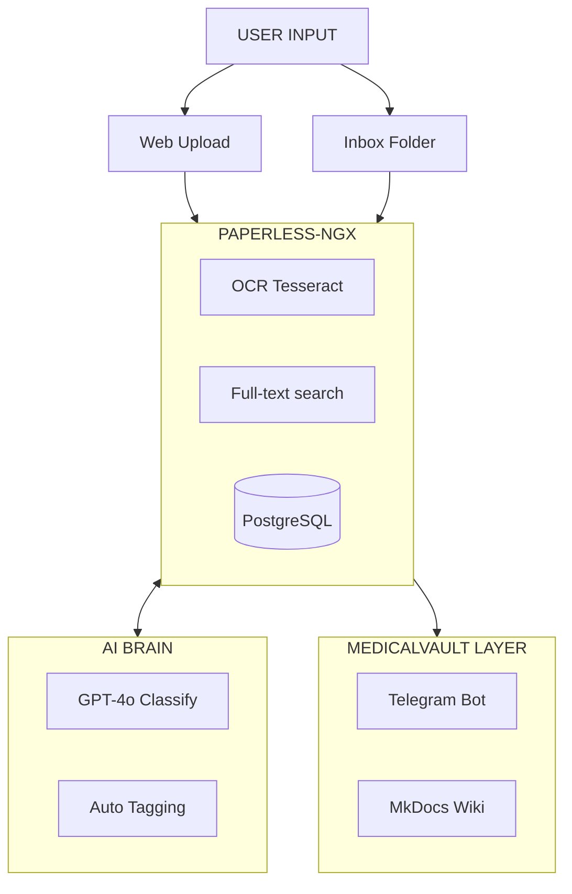

# 🏥 MedicalVault (v2.2 Paperless Edition)

> **Document Management System (DMS) chuyên dụng cho thiết bị y tế.**
> Powered by **Paperless-ngx**, **OpenAI (GPT-4o)** & **Telegram**.

 

---

## 📖 Giới thiệu
**MedicalVault** giúp số hóa và quản lý hàng nghìn tài liệu kỹ thuật, hợp đồng, tờ rơi thiết bị y tế một cách tự động.
- **Tự động hóa:** OCR tiếng Việt/Anh, tự động phân loại hồ sơ bằng AI.
- **Tương tác:** Tìm kiếm tài liệu qua Telegram Bot.
- **Knowledge Base:** Tự động tạo Wiki so sánh cấu hình thiết bị (X-Quang, CT, MRI...).

## 🏗️ Kiến trúc Hệ thống



## 🚀 Tính năng chính (v2.2)

| Tính năng | Mô tả | Trạng thái |
|---|---|---|
| **DMS Core** | Lưu trữ, OCR, Full-text search (Paperless-ngx) | ✅ Ready |
| **AI Classify** | Tự động gắn tag: Hãng, Loại máy, Giá, Dự án | ✅ Ready |
| **Telegram Bot** | Chat để tìm tài liệu (`/search x-quang`) | ✅ Ready |
| **Auto Wiki** | Tự động tạo trang so sánh thiết bị từ dữ liệu | ✅ Week 1 |

## 🛠️ Cài đặt & Sử dụng
> 📘 **Xem hướng dẫn chi tiết:** [USER_MANUAL.md](docs/USER_MANUAL.md)

### 1. Yêu cầu
- Docker & Docker Compose
- API Keys: OpenAI, Telegram Bot Token

### 2. Cài đặt nhanh
```bash
# 1. Clone dự án
git clone https://github.com/phongsun01/Mnemosyne-MedicalVault.git
cd medicalvault

# 2. Cấu hình .env
cp docker_paperless/.env.example docker_paperless/.env
nano docker_paperless/.env
# Điền PAPERLESS_API_TOKEN, OPENAI_API_KEY, TELEGRAM_BOT_TOKEN

# 3. Khởi chạy
cd docker_paperless
docker-compose up -d
```

### 3. Truy cập
- **Paperless Admin:** `http://localhost:8000`
- **Medical Wiki:** `http://localhost:8001`
- **Telegram Bot:** Tìm bot của bạn và gõ `/start`

## 📁 Cấu trúc thư mục
```text
medicalvault/
├── docker_paperless/       # Main Deployment
│   ├── docker-compose.yml
│   ├── mkdocs/             # Wiki Engine
│   └── openclaw/           # Telegram Bot
├── consume/                # Auto-import folder
└── scripts/                # Utility scripts
```

---
**MedicalVault Project** - Designed for Efficiency.
